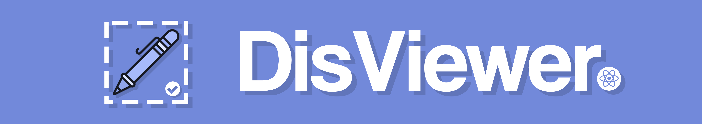

<hr />



<hr />

<p>
  Introducing: <b>DisViewer!</b> The live-preview text editor styled in fashioned Discord theme! This application uses frameworks like <a href="https://electron.atom.io/">Electron</a> and <a href="https://facebook.github.io/react/">React!</a> It shares a lot of functionality from its older predecessor, <a href="https://github.com/Sevelar/Discord-Previewer/">Discord Previewer.</a> 

This project is meant to be a part of the project focusing on creating a live-preview DC Markdown text editor, styled by Discord theme and Markdown styling. The old project will receive its final updates in near future, focusing on bug-fixing, maintaining decent security measures and eventually closing the first phase of the project.
</p>

<hr />

This project was bootstrapped with [Create React App](https://github.com/facebook/create-react-app).

## ⚙️ Install and Run

1. Clone the repository via Git and install all required dependencies:
```bash
git clone https://github.com/Sevelar/DisViewer.git your-project-name
cd your-project-name
npm install
```

2. Once it's done, run the required scripts to get the application up and running:
```bash
npm start
npm electron
```

This should open a new Electron instance with the application ready to go.

## 🔧 Available Scripts

In the project directory, you can run:

### `npm start`

Runs the app in the development mode.<br />
Open [http://localhost:3000](http://localhost:3000) to view it in the browser.

The page will reload if you make edits.<br />
You will also see any lint errors in the console.

### `npm electron`

Opens the new Electron instance.<br />
Once you run the application in development mode, you can use this script in order to create an Electron instance to debug your code.<br />
<br />
Since this application was meant to be opened with Electron in mind, you'll need this script in order to successfully run the application.

### Remaining Scripts

You can find the list of remaining scripts in the [Create React App documentation](https://create-react-app.dev/docs/available-scripts).

## 📝 Learn More

If you are just getting started with React just like me, you should check [Create React App documentation](https://facebook.github.io/create-react-app/docs/getting-started) and [React documentation](https://reactjs.org/).

Other than that, you can check the sections below to learn how Create React App works! 👇

### Code Splitting

This section has moved here: https://facebook.github.io/create-react-app/docs/code-splitting

### Analyzing the Bundle Size

This section has moved here: https://facebook.github.io/create-react-app/docs/analyzing-the-bundle-size

### Making a Progressive Web App

This section has moved here: https://facebook.github.io/create-react-app/docs/making-a-progressive-web-app

### Advanced Configuration

This section has moved here: https://facebook.github.io/create-react-app/docs/advanced-configuration

### Deployment

This section has moved here: https://facebook.github.io/create-react-app/docs/deployment

### `npm run build` fails to minify

This section has moved here: https://facebook.github.io/create-react-app/docs/troubleshooting#npm-run-build-fails-to-minify
